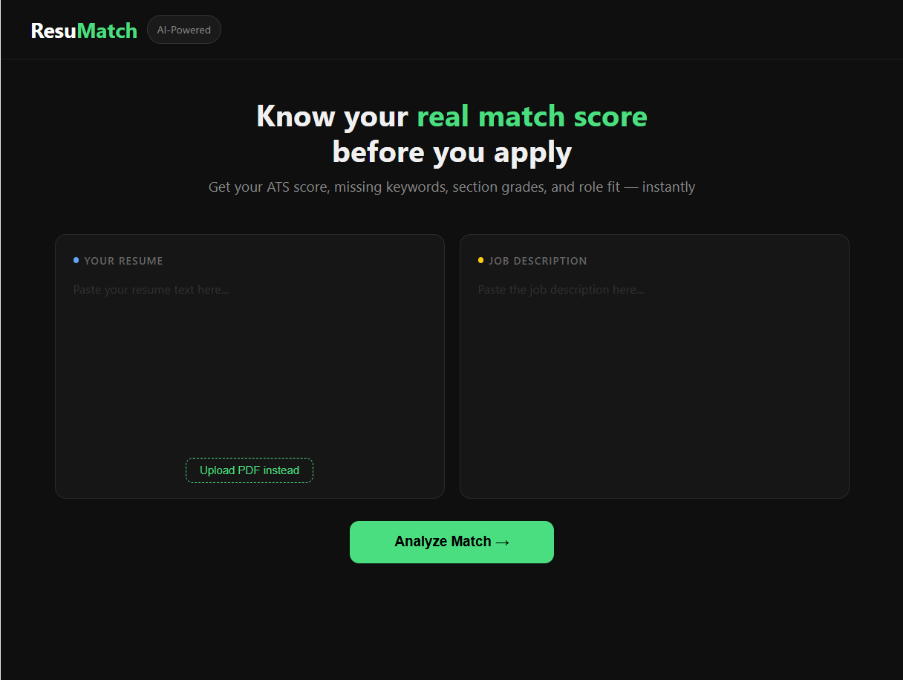
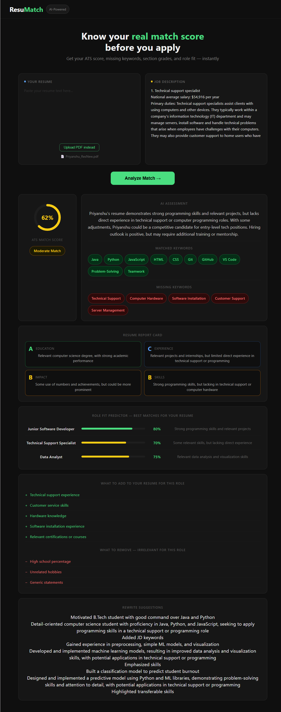

<div align="center">


# 🎯 ResuMatch — AI Resume Analyzer

### Know your real ATS match score before you apply

**[🔗 Live Demo](https://resu-match-rust.vercel.app)** &nbsp;·&nbsp; **[📂 GitHub](https://github.com/PriyanshuCoder07/ResuMatch)**

</div>

---

## 📸 Screenshots

### Home


### Full Analysis Results


---

## 💡 What is ResuMatch?

Most job seekers get rejected before a human ever reads their resume.  
**Applicant Tracking Systems (ATS)** filter out resumes purely based on keyword matching.

**ResuMatch solves this** — paste your resume and any job description, and get:

| Feature | Description |
|---|---|
| 🎯 ATS Match Score | Animated 0–100% score showing real JD match |
| ✅ Matched Keywords | Skills already present in both resume and JD |
| ❌ Missing Keywords | Critical JD keywords absent from your resume |
| 📊 Resume Report Card | A/B/C/D grades for Skills, Experience, Education, Impact |
| 🔮 Role Fit Predictor | Top 3 job roles your resume is best suited for |
| ✍️ Rewrite Suggestions | 3 specific resume lines rewritten with JD keywords |
| ➕ What to Add | Specific items to add to improve your chances |
| ➖ What to Remove | Irrelevant content hurting your ATS score |
| 📄 PDF Upload | Upload resume as PDF — no copy-paste needed |

---

## 🚀 Live Demo

> 🌐 **[https://resu-match-rust.vercel.app](https://resu-match-rust.vercel.app)**

---

## 🛠️ Tech Stack
Frontend    →  React + Vite
Backend     →  Python + Flask
AI Model    →  LLaMA 3.3 70B via Groq API (free, fast)
PDF Parse   →  pdfplumber
Deployment  →  Vercel (frontend) + Render (backend)

---

## ⚙️ How It Works
User pastes resume (or uploads PDF) + job description
↓
React sends POST request to Flask backend
↓
Flask builds structured ATS prompt with resume + JD
↓
Groq API runs LLaMA 3.3 70B → returns structured JSON
↓
React renders score, keywords, grades, suggestions

---

## 🧑‍💻 Run Locally

### Prerequisites
- Node.js v18+
- Python 3.10+
- Free Groq API key → [console.groq.com](https://console.groq.com)

### 1. Clone
```bash
git clone https://github.com/PriyanshuCoder07/ResuMatch.git
cd ResuMatch
```

### 2. Backend
```bash
cd backend
pip install flask flask-cors groq pdfplumber

# Windows
$env:GROQ_API_KEY="your_key_here"

# Mac/Linux
export GROQ_API_KEY="your_key_here"

python app.py
```

### 3. Frontend
```bash
cd frontend
npm install
npm run dev
```

### 4. Open
http://localhost:5173

---

## 📁 Project Structure
ResuMatch/
├── frontend/
│   └── src/
│       └── App.jsx          # Full React UI + all components
├── backend/
│   └── app.py               # Flask API + Groq LLaMA integration
├── screenshots/
│   ├── home.png
│   └── results.png
└── README.md

---

## 🌱 Future Improvements

- [ ] Export improved resume as PDF
- [ ] Score history — compare across multiple JDs
- [ ] LinkedIn job description auto-fetch
- [ ] Resume builder with AI suggestions applied live

---

## 👨‍💻 Author

<div align="center">

**Priyanshu Raj**  
B.Tech CSE — Galgotias University  

[](https://github.com/PriyanshuCoder07)

</div>